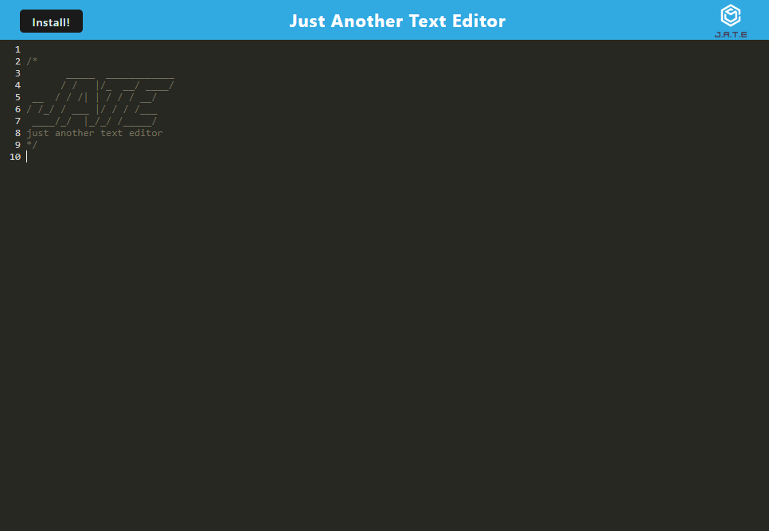

# Just Another Text Editor


## Description

Just Another Text Editor is a PWA text editor for JS, which saves your text and loads it when you open the page.

You may view a deployed version of this project [here](https://text-editor.dev.133700.xyz/).



## Table of Contents

- [Description](#description)
- [Installation](#installation)
- [Usage](#usage)
- [How to Contribute](#how-to-contribute)
- [Tests](#tests)
- [Questions](#questions)
- [License](#license)

## Installation

To install Just Another Text Editor, you must first clone the repository.

```bash
git clone https://github.com/ashoener/text-editor.git
cd text-editor
```

Afterwards, run the following command:

```bash
npm install
```

## Usage

Run the command `npm start` to build the client and start the server.

## How to Contribute

If you would like to contribute, create a pull request. Be sure to include information about what your changes do.

## Tests

Currently, there are no tests included with this project. They may be created in the future.

## Questions

If you have any questions, you may contact me via [GitHub](https://github.com/ashoener) or by [email](mailto:a.b.shoener@gmail.com).

## License

This project is covered under the MIT license. You may view it [here](/LICENSE).
